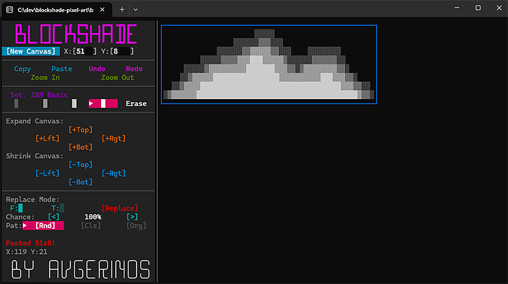

# BlockShade Pixel Art Editor



A full-screen Terminal Pixel Art Editor built with Go and [Bubble Tea](https://github.com/charmbracelet/bubbletea), designed for ANSI block shading (░▒▓██).

## Features

- 🎨 **Multiple Brush Sets:** IBM Basic, IBM Extended, Blocks.
- 🖱️ **Full Mouse Support:** Click, drag, right-click to erase. *(Note: If you run this inside an IDE integrated terminal, such as VSCode, you might need to hold `Alt` while clicking!)*
- 🖼️ **Dynamic Canvas:** Expand or shrink the canvas from any direction in real-time, or create a brand new canvas specifying custom dimensions.
- 🔍 **Zoom In / Out:** Scale your canvas up to 10x for fine-grained editing.
- 📋 **Clipboard Support:** Copy your ASCII/ANSI art to the clipboard or paste directly onto the canvas.
- ⏪ **Undo / Redo:** Full timeline support. Actions are intelligently grouped, and branching timelines are handled flawlessly.
- ✨ **Replace Mode (with Organic Dithering):** Replace one character with another across the canvas. Control the replacement chance (e.g., 50%) and choose between random noise, clustered islands (Bilinear Noise), or organic film grain (Interleaved Gradient Noise).

## Requirements

- **Go 1.21** or higher.
- A modern terminal emulator with full mouse tracking support (e.g., Windows Terminal, iTerm2, Alacritty, Kitty).

## Installation

### Option 1: Quick Install (Recommended)

If you have Go installed, you can download and compile the binary directly from GitHub into your `GOPATH/bin`:

```bash
go install github.com/avgerinos8/blockshade-pixel-art@latest
```

### Option 2: Build from Source

Clone the repository and build the binary manually:

```bash
git clone https://github.com/avgerinos8/blockshade-pixel-art
cd blockshade-pixel-art
go build -o blockshade
./blockshade
```

## Usage

Run the executable in your terminal:

```bash
blockshade
```

**Controls:**
- **Left Click & Drag:** Paint with the selected character.
- **Right Click & Drag:** Erase (paint with spaces).
- **Mouse Wheel:** Cycle through all available brushes (automatically changes the Brush Set in the sidebar).
- **Mouse Wheel (Hover X/Y inputs):** Quickly increment or decrement the New Canvas dimensions.
- **Ctrl+Z:** Undo.
- **Ctrl+Y:** Redo.
- **Ctrl+C / Esc:** Exit the editor.

## Replace Mode Details

The `Replace Mode` in the bottom left of the sidebar allows you to perform advanced texture replacements:
- Left/Right click on `Frm:` and `To:` to cycle through all available characters.
- Set the `Chance` slider.
- Select a pattern:
  - **Rnd:** Uniform random replacement.
  - **Cls (Cluster):** Generates contiguous "islands" of characters.
  - **Org (Organic):** Uses Interleaved Gradient Noise for a beautiful, evenly distributed sand/grain effect.
